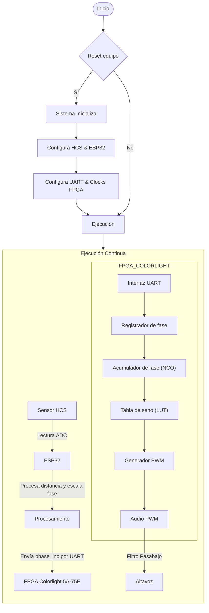

# THEREMIN (PROYECTO ELECTRÓNICA DIGITAL)
En el presente repositorio se expondrá en que conssitió el proyecto realizado en la aignatura de electrónica digital, mostrando el paso a paso realizado
- Dilan Mateo Torres Muñoz
- Arturo Moreno Covaría
- Nicolás Zarate Acosta
- Edwin David Vega Tatis
# Resumen
Este proyecto consiste en el diseño e implementación de una versión digital del theremin, un instrumento musical electrónico que se toca sin contacto físico. El sistema fue desarrollado en el marco del curso de Electrónica Digital de la Universidad Nacional de Colombia (2025-I), integrando sensores ultrasónicos, un microcontrolador ESP32 y una FPGA.

La arquitectura general del proyecto permite controlar el tono del sonido mediante el movimiento de la mano, detectado por sensores ultrasónicos. La distancia medida es procesada por el ESP32, que calcula un incremento de fase (phase_inc) proporcional a la distancia. Este valor es enviado por UART a la FPGA, donde se genera digitalmente una onda senoidal mediante un acumulador de fase (NCO) y una tabla de búsqueda (LUT). Finalmente, la señal es convertida a audio utilizando modulación por ancho de pulso (PWM) y filtrada para su salida por un altavoz.

El objetivo principal fue aplicar conceptos fundamentales de diseño digital, comunicación serial y procesamiento de señales, logrando una implementación funcional que simula el comportamiento real de un theremin tradicional.

# Objetivos del proyecto
- Construir un diseño electrónico que detecte movimiento, en este caso que detecte el movimiento de la mano y la posición de ella mediante sensores ultrasónicos
- Diseñar un modelo que permita generar sonidos, con sus respectivas características (frecuencia y volumen) según la distancia detectada por el sensor.
# Tecnologías utilizadas
- Sensor ultrasónico HCSR04: detección de distancia sin contacto
- ESP32: procesamiento de señales y comunicación UART
- FPGA Colorlight 5A-75E: generación de la señal de audio digital
- Verilog HDL: desarrollo de módulos digitales en FPGA
- UART: protocolo de comunicación entre el ESP32 y la FPGA
- PWM: para convertir la señal digital en una onda audible
- Filtro pasabajo: para suavizar la salida de PWM y alimentar un altavoz

  

# ¿Que es un theremin?

Un theremin es un instrumento musical electrónico inventado por Léon Theremin, que se caracteriza por ser tocado sin contacto físico directo.
El theremin tiene dos antenas:

Una vertical, que controla la altura del sonido (frecuencia) o la nota musical. Se maneja acercando o alejando la mano a esta antena.

Una horizontal o en forma de lazo, que controla el volumen. Al acercar la mano a esta antena, el sonido disminuye.

El theremin genera tonos mediante osciladores electrónicos. Las manos del intérprete alteran los campos electromagnéticos alrededor de las antenas, modificando la frecuencia y el volumen.

# Planteamiento

## Requrimentos funcionales:
## Diagrama ASM/ Maquina de estados/ diagramas funcionales:
## Diagrama RTL del SoC y su mòdulo:
## Simulaciones:
## Video simulacion: 
## Logs de make log-prn, make log-syn
## ¿Còmo interactùa con entornos externos?
## Video del proyecto

